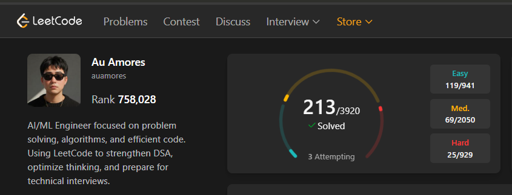

# leetcode-solutions
## LeetCode Profile

[](https://leetcode.com/u/auamores/)

> Systematic algorithmic problem solving — written clean, reasoned carefully.

[](https://leetcode.com/u/auamores/)
[](https://www.python.org/)
[]()

---

## Overview

Personal archive of LeetCode solutions — written for clarity, not cleverness.  
Each solution prioritizes readable logic and sound complexity tradeoffs over micro-optimizations.

Primary language: **Python**  
Focus: DSA fundamentals, interview pattern recognition, and clean implementation.

---

## Structure

```
leetcode-solutions/
├── arrays/
├── strings/
├── linked-lists/
├── trees/
├── graphs/
├── dynamic-programming/
├── binary-search/
├── sliding-window/
├── stack-queue/
└── math/
```

> Organized by topic. Each file includes problem link, time/space complexity, and solution notes where warranted.

---

## Approach

| Principle | Practice |
|---|---|
| Understand before code | Read constraints, map edge cases first |
| Complexity first | Always state O(n) before writing |
| Pattern recognition | Solutions grouped by technique, not problem number |
| Clean code | No magic numbers, meaningful variable names |

---

## Topics Covered

- Arrays & Hashing
- Two Pointers / Sliding Window
- Binary Search
- Linked Lists
- Trees & BST
- Graphs (BFS / DFS)
- Dynamic Programming
- Backtracking
- Heaps & Priority Queues
- Bit Manipulation
- and more...

---

## Progress

Tracked on LeetCode — [auamores](https://leetcode.com/u/auamores/)

---

## About

Built by **Au** — AI/ML Engineer specializing in MLSec.  
This repo is a working document, not a showcase. Expect ongoing commits.

[](https://au-dev-cs.vercel.app)
[](https://linkedin.com/in/au-amores)

---

<sub>MIT License</sub>

## LeetCode Profile


